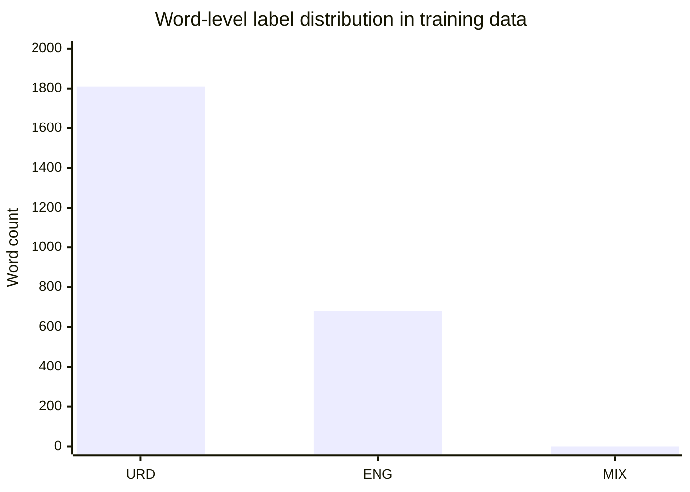
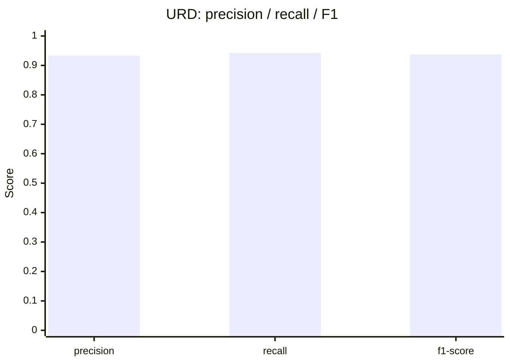
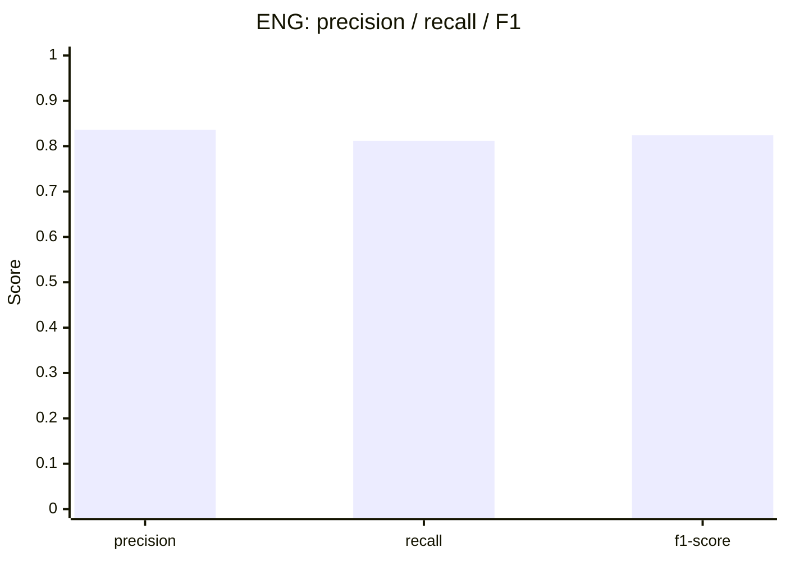
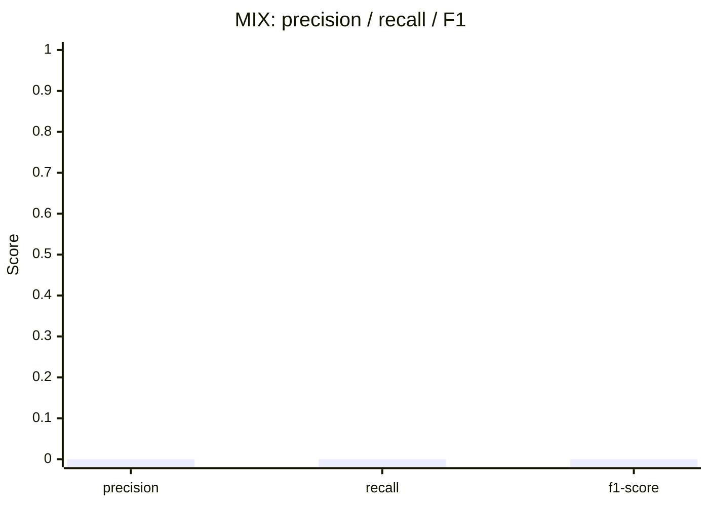

# Roman Urdu Code-Switching Language ID

A model and demo app that look at a Roman Urdu / English sentence and tag every single word as Urdu, English, or a mixed hybrid.

## Why this matters

Most Pakistanis online don't write in pure Urdu or pure English, they mix both in the same sentence without thinking about it, something like "Aaj mera mood nahi hai for anything." Standard NLP tools are built around the idea that a piece of text is in one language, so they tend to break or give weird results on text like this. This project tackles that gap directly: it labels each word by language so that anything built on top of it (sentiment analysis, chatbots, keyboard suggestions, content moderation) can actually understand mixed Roman Urdu text instead of choking on it.

## Live Demo

Streamlit app: [https://huggingface.co/spaces/hamnaheh/code-switching-langid-si26-humna-demo](https://huggingface.co/spaces/hamnaheh/code-switching-langid-si26-humna-demo)

*(Note: replace this with your actual Space URL once it's deployed and live, I wasn't able to confirm the Space is up from here.)*

Model on the Hub: [hamnaheh/code-switching-langid-si26-humna](https://huggingface.co/hamnaheh/code-switching-langid-si26-humna)

## How it works

You type a sentence that mixes Roman Urdu and English, the way people actually text. The app splits it into words and runs them through a small language model (XLM-RoBERTa) that was fine-tuned to recognize which language each word belongs to. Every word gets a tag, Urdu, English, or Mix, and the app shows them color coded so you can see the mix at a glance. Under the hood it's just token classification, the same kind of model used for things like part-of-speech tagging, just trained on a different label set.



## Results

The model was fine-tuned on 220 hand-filtered code-switched sentences (2,490 word-level labels) and evaluated on a held-out test split.

| Metric | Score |
|---|---|
| Accuracy | 0.908 |
| F1 (URD) | 0.937 |
| F1 (ENG) | 0.824 |
| F1 (MIX) | 0.000 |
| Macro F1 | 0.587 |

Confusion matrix (rows are the true label, columns are what the model predicted):

| True \ Predicted | URD | ENG | MIX |
|---|---|---|---|
| **URD** | 359 | 22 | 0 |
| **ENG** | 26 | 112 | 0 |
| **MIX** | 0 | 0 | 0 |

Precision, recall, and F1 per label:







A quick honest note on that MIX score: it's zero because the training data ended up with no MIX-labeled examples at all. The filtering step in the Week 6 notebook only kept words matching plain letters, so hyphenated hybrid words (the ones that would've been tagged MIX) never made it in. The model literally never saw a MIX example to learn from, so it can't predict one. URD and ENG are the numbers that reflect real model performance here.

## How to run locally

Clone the repo and set up the demo app:

```bash
git clone https://github.com/hamnasz/code-switching-codesaviours-si26-humna.git
cd code-switching-codesaviours-si26-humna/SI26-Week7
pip install streamlit transformers torch huggingface_hub
streamlit run app.py
```

The app pulls the fine-tuned model straight from the Hugging Face Hub the first time it runs, so no separate download step is needed.

If you'd rather just use the model in your own Python code:

```bash
pip install transformers torch
```

```python
from transformers import AutoTokenizer, AutoModelForTokenClassification

tokenizer = AutoTokenizer.from_pretrained("hamnaheh/code-switching-langid-si26-humna")
model = AutoModelForTokenClassification.from_pretrained("hamnaheh/code-switching-langid-si26-humna")
```

## Repo contents

| Path | What's in it |
|---|---|
| `SI26-Week6/SI26-Week6-Humna.ipynb` | Builds and labels the dataset from public Roman Urdu text |
| `SI26-Week6/dataset.csv` | Final labeled dataset (220 sentences, 2,490 word rows) |
| `SI26-Week7/SI26-Week7-humna.ipynb` | Fine-tunes XLM-RoBERTa on the dataset and evaluates it |
| `SI26-Week7/app.py` | Streamlit demo app |
| `SI26-Week7/requirements.txt` | Dependencies for the demo app |

Built by: Humna Imran | Code Saviours SI-26 | 2026
